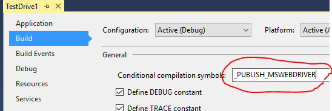

# NuGet package - Selenium Microsoft WebDriver

[](https://www.nuget.org/packages/Selenium.WebDriver.MicrosoftWebDriver/)

## What's this? 

This NuGet package install Microsoft WebDriver into your Unit Test Project.

Read more about [Microsoft WebDriver](https://blogs.windows.com/msedgedev/2015/07/23/bringing-automated-testing-to-microsoft-edge-through-webdriver/)

"MicrosoftWebDriver.exe" added as a linked project item, and copied to bin folder at the build.

## How to install?

For example, at the package manager console on Visual Studio, enter following command.  

    PM> Install-Package Selenium.WebDriver.MicrosoftWebDriver

## Detail
 
### How to include the driver file into published files?

"MicrosoftWebDriver.exe" isn't included in published files on default configuration. This behavior is by design.

If you want to include "MicrosoftWebDriver.exe" into published files, please define `_PUBLISH_MSWEBDRIVER` compilation symbol.



Another way, you can define `PublishMSWebDriver` property with value is "true" in MSBuild file (.csproj, .vbproj, etc...) to publish the driver file instead of define compilation symbol.

```xml
  <Project ...>
    ...
    <PropertyGroup>
      ...
      <PublishMSWebDriver>true</PublishMSWebDriver>
      ...
    </PropertyGroup>
...
</Project>
```

#### Note 

`PublishMSWebDriver` MSBuild property always override the condition of define `_PUBLISH_MSWEBDRIVER` compilation symbol or not. If you define `PublishMSWebDriver` MSBuild property with false, then the driver file isn't included in publish files whenever define `_PUBLISH_MSWEBDRIVER` compilation symbol or not.

## Credits
Big credit to @jsakamoto. I created this nuget based on this repo: https://github.com/jsakamoto/nupkg-selenium-webdriver-iedriver/